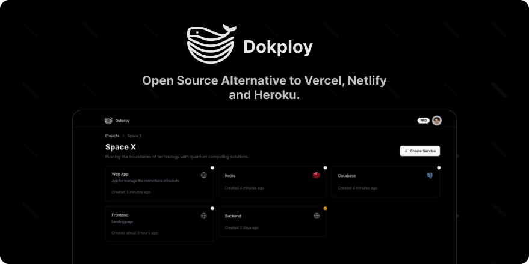

<div align="center">
  <a href="https://dokploy.com">
    
  </a>
  </br>
  </br>
  <p>Join us on Discord for help, feedback, and discussions!</p>
  <a href="https://discord.gg/2tBnJ3jDJc">
    
  </a>
</div>
<br />


Dokploy is a free, self-hostable Platform as a Service (PaaS) that simplifies the deployment and management of applications and databases.

## ✨ Features

Dokploy includes multiple features to make your life easier.

- **Applications**: Deploy any type of application (Node.js, PHP, Python, Go, Ruby, etc.).
- **Databases**: Create and manage databases with support for MySQL, PostgreSQL, MongoDB, MariaDB, libsql, and Redis.
- **Backups**: Automate backups for databases to an external storage destination.
- **Docker Compose**: Native support for Docker Compose to manage complex applications.
- **Multi Node**: Scale applications to multiple nodes using Docker Swarm to manage the cluster.
- **Templates**: Deploy open-source templates (Plausible, Pocketbase, Calcom, etc.) with a single click.
- **Traefik Integration**: Automatically integrates with Traefik for routing and load balancing.
- **Real-time Monitoring**: Monitor CPU, memory, storage, and network usage for every resource.
- **Docker Management**: Easily deploy and manage Docker containers.
- **CLI/API**: Manage your applications and databases using the command line or through the API.
- **Notifications**: Get notified when your deployments succeed or fail (via Slack, Discord, Telegram, Email, etc.).
- **Multi Server**: Deploy and manage your applications remotely to external servers.
- **Self-Hosted**: Self-host Dokploy on your VPS.

## 🚀 Getting Started

To get started, run the following command on a VPS:

Want to skip the installation process? [Try the Dokploy Cloud](https://app.dokploy.com).

```bash
EXPECTED_SHA256="<publish-installer-checksum-here>"
curl -fsSLo /tmp/dokploy-install.sh https://dokploy.com/install.sh
echo "${EXPECTED_SHA256}  /tmp/dokploy-install.sh" | sha256sum -c -
bash /tmp/dokploy-install.sh
```

For hardened production guidance (TLS, firewall, backup/restore), see [`SELF_HOSTED_HARDENING.md`](SELF_HOSTED_HARDENING.md).  
For enterprise license behavior in offline/degraded mode, see [`ENTERPRISE_OFFLINE_MODE.md`](ENTERPRISE_OFFLINE_MODE.md).  
For local fork license setup and production operations, see [`LOCAL_LICENSE_PRODUCTION_PLAYBOOK.md`](LOCAL_LICENSE_PRODUCTION_PLAYBOOK.md).  
For gradual rollout, rollback, and validation checklist, see [`OPERATIONAL_RUNBOOK.md`](OPERATIONAL_RUNBOOK.md).
For dependency residual-risk tracking and remediation priorities, see [`DEPENDENCY_RESIDUAL_RISK.md`](DEPENDENCY_RESIDUAL_RISK.md).
Release-by-release risk entries are tracked in [`RISK_CHANGELOG.md`](RISK_CHANGELOG.md).

For detailed documentation, visit [docs.dokploy.com](https://docs.dokploy.com).

## 🌐 Languages / Idiomas

- Default UI language: `pt-BR`
- Optional language: `en`
- User preference is persisted in the user profile (`user.locale`) and mirrored to `dokploy_locale` cookie.
- For legacy users without locale set, Dokploy falls back to `pt-BR`.


[Github Sponsors](https://github.com/sponsors/Siumauricio)

### Contributors 🤝

<a href="https://github.com/dokploy/dokploy/graphs/contributors">
  
</a>

## 📺 Video Tutorial

<a href="https://youtu.be/mznYKPvhcfw">
  
</a>

## 🤝 Contributing

Check out the [Contributing Guide](CONTRIBUTING.md) for more information.
